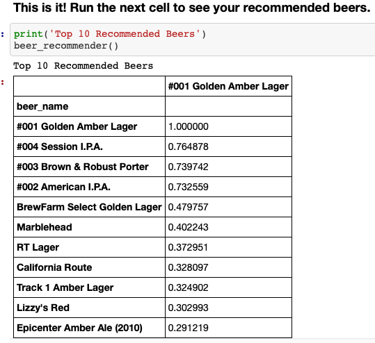

# Craft Beer Recommendation Engine

## **Problem Statement**
### Ready to find your next craft beer? 

As a craft beer drinker, I wanted to build a basic recommendation engine to help others find their next favorite beer based on beer they already enjoy. This project is an example of content-based recommendations. 

## **Data Collection**
Data for this project was pulled from Kaggle, and can be found [here](https://www.kaggle.com/nickhould/craft-cans?select=beers.csv). In January 2017, Kaggle user Jean-NicholasHould scraped the now defunct CraftCans.com to create a dataset containing information on 2000+ canned craft beer varieties and 500+ US breweries. 

A tutorial for their web-scraping method can be found [here](http://www.jeannicholashould.com/python-web-scraping-tutorial-for-craft-beers.html).

The basis for this project draws heavily from the datacamp course [“Building Recommendation Engines in Python.”](https://www.datacamp.com/instructors/mrrocallaghan)

## **Data Cleaning & Processing**
As the data for this project was already in good shape, there wasn’t much initial cleaning required. The csv files containing brewery information and beer information were merged on brewery_id, and a few column names were changed for clarity. Additional columns were dropped due to missing values. The final dataframe consisted of columns containing information on the beer name, brewery name, alcohol by volume (abv), and brewery location (city).

### Jaccard Similarity - Processing
For this project, two content-based recommendation engines were created. The first focused on Jaccard similarity, which is measured by comparing the number of shared attributes of two items divided by the total number of combined attributes. The Jaccard similarity score ranges from 0 to 1, with 1 being a “match/most similar.”  In this project, the Jaccard similarity was measured between each beer based on beer_style (lager, IPA, etc.). 

The first step in this process was to apply pandas’ crosstab function to the merged and cleaned dataset to create a vectorized version of the beer attributes. To calculate the Jaccard similarity scores for the entire dataset, scipy’s pdist was applied to the values of the vectorized attributes with the calculation metric set as “jaccard.” Pdist actually measures the distances (differences) between the beers rather than the similarity. To create a similarity array, the results were subtracted from 1 and then converted to a dataframe. 

The resulting dataframe is filtered based on the preferred beer to produce several beer recommendations.

As you can see in the screenshot, all of the recommended beers for Arjuna share the beer type “Witbier.” As this model only considers beer type, it is not able to offer very complex recommendations. 

### Cosine Similarity - Processing
The second recommendation engine for this project focused on cosine similarity. This metric “quantifies the similarity between two or more vectors” (Alake 2020). For this project, cosine similarity was measured on text-based similarities between each beer. Cosine similarity scores measure from 0 to 1, with 1 being an exact match. 

This method is dependent on analyzing text-based similarities and requires an item “description” rather than the clearly labeled attributes (abv, beer_style, etc.). As the dataset did not contain a “description” column, the dataframe was converted to string and the abv, beer_style, brewery_name, and city columns were concatenated to create a description for each beer.

TF-IDF—term frequency inverse document frequency—is used to convert the item description into something that can be used for comparison. TFIDF separates out each word into a feature, and gives greater weight to the most “important” words to filter out commonly used words (like “the”). The TfidfVectorizer from scikit-learn handily completes this step and was applied to the dataframe containing just the column for beer name and the description column. The resulting vectorized data can now be used to determine cosine similarity.  Calculating cosine similarity for the entire dataframe can be easily completed by using scikit-learn’s cosine_similarity function on the vectorized dataframe. 

Like with the Jaccard example, the final dataframe can be filtered based on the preferred beer to generate recommendations. For this example, a field for user input was added to create a basic recommendation engine.

In this screenshot, you can see the recommended beers are very different from the Jaccard model. This model considers more than just beer type, and can offer a more complex recommendation.

## **Final Recommendation Engine**

### Has all this talk about Jaccard and cosine similarity made you thirsty?
**I thought so. [Let’s find your next craft beer.](Craft Beer Recommendation.ipynb)**

The final recommendation engine is based on cosine similarity, as it allows for a more “nuanced” beer recommendation than the Jaccard score. A dropdown list containing all of the available beers for selection was also added using ipywidgets. The dropdown ensures that the user is only able to select a beer that exists in the dataset and omits possible spelling/capitalization errors.

While the Jupyter notebook in Github is “static,” the required data for replication has been added to this repository. 

## **Takeaways**
This project was a great first step in building a recommendation engine. 

By far, the biggest limitation was the dataset. The “description” column created for this project consisted of just the brewery name, brewing location, beer style, and abv. As a result, the recommendations were based on only a few factors. With information on beer flavors, brewing methods, distribution areas, etc., it would be possible to create a much more robust recommendation engine. Additionally, the dataset only contains information on _canned_ craft beers, which leaves out any beers that are only available in bottles. Furthermore, the data was scraped in 2017. Included breweries may no longer have the same set of beers available or may even be closed. Finally, the website used to collect the dataset is no longer around. As a result, it is not possible to personally verify the accuracy of the scraped data.

In future versions of this project, I would also like to roll out a web app alongside the recommendation engine. 

## **Tools & Documentation**
 For this project, the following tools and sources were used:
 - scikit-learn
   - [Associated Documentation - Jaccard Score](https://scikit-learn.org/stable/modules/generated/sklearn.metrics.jaccard_score.html)
   - [Associated Documentation - Cosine Similarity](https://scikit-learn.org/stable/modules/generated/sklearn.metrics.pairwise.cosine_similarity.html)
   - [Associated Documentation - TF-IDF](https://scikit-learn.org/stable/modules/generated/sklearn.feature_extraction.text.TfidfVectorizer.html)
 - scipy
   - [Associated Documentation](https://docs.scipy.org/doc/scipy/reference/spatial.html)
 - ipywidgets
   - [Associated Documentation](https://ipywidgets.readthedocs.io/en/stable/user_guide.html)
 - Alake, Richmond. “Understanding Cosine Similarity And Its Application.” _Towards Data Science_, 14 September 2020. https://towardsdatascience.com/understanding-cosine-similarity-and-its-application-fd42f585296a .
 
 - Jean-NicholasHould. “Craft Beers Dataset.” _Kaggle_. https://www.kaggle.com/nickhould/craft-cans?select=beers.csv .
 
 - O’Callaghan, Rob. “Building Recommendation Engines in Python.” _Datacamp_. https://www.datacamp.com/instructors/mrrocallaghan .
